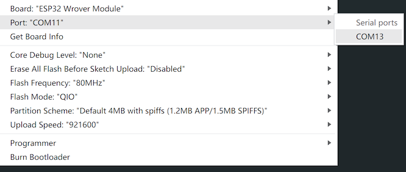

> :one: 本课程属于船说系列课程之一，[💰单课购买点这里](https://www.bilibili.com/cheese/play/ss3380){target="_blank"}
> :two: 你也可以选择购买『船说系列课程-年度会员』产品『船票』，畅享一年内无限制学习已上线的所有船说系列课程：[💰 船票购买入口](https://www.bilibili.com/cheese/pages/packageCourseDetail?productId=598){target="_blank"}
{.is-success}

# 💗温馨提醒【初航我带你，远航靠自己】

🙋‍♂️哈喽各位同学，👏欢迎加入《船说：C语言全能实战课》的课程学习中来～

> 1️⃣ 本课程的开课日期为6月28日，课程节数为200+节，课程学习永久有效。
{.is-success}

> 2️⃣ 做好课前准备，需自行注册以下刷题平台：{.is-success}

> ✅海贼OJ：https://oj.haizeix.com/
✅欧拉计划：https://projecteuler.net/
{.is-info}

> PS：无法访问欧拉原站，可不注册欧拉账号，使用中文替代站点看题：http://pe-cn.github.io/
{.is-warning}

> 3️⃣ 课程代码&讲义在下方，可以自取。
> 同时也在Github上线了所有代码：👉 https地址: https://github.com/huguangAOA/Bilibili-Clang.git
{.is-success}

> 4️⃣ 课程内容更新上线后，船长都会在群内通知大家
{.is-success}

> 5️⃣ 同学有问题的话可以咨询船长，老师会在看到后第一时间进行解答哦
{.is-success}

> 有其他搞不明白的，可以找Bili姐：


# 第一章 将C语言用起来
> 学习提要
> 1. 学习课程时一定不要跳看课程，每节课都会有着不同的知识点。
> 2. 配置学习环境的配置(必要)，推荐配置Linux环境。
> 3. 学习Linux环境的使用和一些Linux环境中常用的命令。
> 4. 需要熟练掌握VIM编辑器(在Linux环境)的使用。
> 5. 知道[cppreference](https://en.cppreference.com/w/)参考网站，在后续的学习中知道如何查询。
> 6. 对于编码规范，根据船长的代码规范来规范自己的编码习惯。

> 授课PPT  
> 1. [ACM金牌带你零基础直达C语言精通-1.1-课程导学](c_language_resource/part1/chapter01/pptx/c_language_chapter01_1.pdf)
> 2. [ACM金牌带你零基础直达C语言精通-1.2-学环境配置](c_language_resource/part1/chapter01/pptx/c_language_chapter01_2_12_14_15.pdf)
> 3. [ACM金牌带你零基础直达C语言精通-1.3-Linux环境配置:如何获取配置文档](c_language_resource/part1/chapter01/pptx/c_language_chapter01_3.pdf)
> 4. [ACM金牌带你零基础直达C语言精通-1.4-1.6-Linux环境配置:服务器购买-Linux环境配置:云主机链接](c_language_resource/part1/chapter01/pptx/c_language_chapter01_4to6.pdf) 
> 5. [ACM金牌带你零基础直达C语言精通-1.7-1.11-Linux环境配置:云主机的配置-Linux环境配置:vim的基本使用](c_language_resource/part1/chapter01/pptx/c_language_chapter01_7to11.pdf) 
> 6. [ACM金牌带你零基础直达C语言精通-1.13-百度+阿里:编码规范介绍](c_language_resource/part1/chapter01/pptx/c_language_chapter01_13(1).pdf) 
> 7. [ACM金牌带你零基础直达C语言精通-1.13-谷歌:编码规范介绍](c_language_resource/part1/chapter01/pptx/c_language_chapter01_13(2).pdf) 
> 8. [ACM金牌带你零基础直达C语言精通-1.14-将C语言用起来](c_language_resource/part1/chapter01/pptx/c_language_chapter01_14.pdf)   
> ✅DevCpp 6.7.5 和Tabby的安装包:[百度网盘链接](https://pan.baidu.com/s/1771OHbtIEzwRyRJj09ruBw?pwd=3zuh){.is-info}

# 第二章 类型、运算符与表达式
> 学习提要  
> 1. ❗在学习过程中一定要跟着船长一起敲代码;
> 2. 理解什么是类型，什么是变量;
> 3. 看完课程后有二进制，十六进制的概念，学会各种进制之间的转换;
> 4. 记忆常用类型，以及他们的长度，字符类型需要记住常用的ASCII编码，例如'a' = 97;
> 5. 学会使用printf和scanf，以及如何使用sscanf，sprintf函数;
> 6. 学会使用基本运算符，并理解每个运算符的原理，对于运算符优先级，只要多写代码多尝试，就可以记住了;
> 7. 记住常用的数学函数，以及他们的返回值类型是什么，以及如何使用;
> 8. 看完船长对OJ题目的讲解后，通过自己再实现一次加强对代码的理解;

> 授课PPT
> 1. [ACM金牌带你零基础直达C语言精通-2-类型、运算符与表达式](c_language_resource/part1/chapter02/pptx/c_language_chapter02_1.pdf)  

> 参考程序
> 1. [ACM金牌带你零基础直达C语言精通-2.5-常用数据类型:代码演示--1.types.c](c_language_resource/part1/chapter02/code/1.types.c)
> 2. [ACM金牌带你零基础直达C语言精通-2.6-printf函数的基本用法--2.printf.c](c_language_resource/part1/chapter02/code/2.printf.c)
> 3. [ACM金牌带你零基础直达C语言精通-2.7-scanf函数的基本用法--3.scanf.c](c_language_resource/part1/chapter02/code/3.scanf.c)
> 4. [ACM金牌带你零基础直达C语言精通-2.8-随堂练习1:输出数字位数--4.test1.c](c_language_resource/part1/chapter02/code/4.test1.c)
> 5. [ACM金牌带你零基础直达C语言精通-2.9-随堂练习2:读入带空格的字符串--5.string.c](c_language_resource/part1/chapter02/code/5.string.c)
> 6. [ACM金牌带你零基础直达C语言精通-2.9-随堂练习2:读入带空格的字符串--6.test2.c](c_language_resource/part1/chapter02/code/6.test2.c)
> 7. [ACM金牌带你零基础直达C语言精通-2.10-sscanf和sprintf函数的讲解--7.sscanf.c](c_language_resource/part1/chapter02/code/7.sscanf.c)
> 8. [ACM金牌带你零基础直达C语言精通-2.10-sscanf和sprintf函数的讲解--8.sprintf.c](c_language_resource/part1/chapter02/code/8.sprintf.c)
> 9. [ACM金牌带你零基础直达C语言精通-2.11-随堂练习:给输出内容加一个框--9.test3.c](c_language_resource/part1/chapter02/code/9.test3.c)
> 10. [ACM金牌带你零基础直达C语言精通-2.12-基本运算符--10.operator.c](c_language_resource/part1/chapter02/code/10.operator.c)
> 11. [ACM金牌带你零基础直达C语言精通-2.13-位运算:讲解与演示--11.digit.c](c_language_resource/part1/chapter02/code/11.digit.c)
> 12. [ACM金牌带你零基础直达C语言精通-2.14-运算符优先级讲解--12.assign.c](c_language_resource/part1/chapter02/code/12.assign.c)
> 13. [ACM金牌带你零基础直达C语言精通-2.15-常用数学函数--13.math.c](c_language_resource/part1/chapter02/code/13.math.c)
> 14. [ACM金牌带你零基础直达C语言精通-2.16-随堂练习4-5:数学函数的使用--14.test4.c](c_language_resource/part1/chapter02/code/14.test4.c)
> 15. [ACM金牌带你零基础直达C语言精通-2.16-随堂练习4-5:数学函数的使用--15.test5.c](c_language_resource/part1/chapter02/code/15.test5.c)
> 16. [ACM金牌带你零基础直达C语言精通-2.17-如何在海贼OJ测试代码--16.HZOJ-1.c](c_language_resource/part1/chapter02/code/16.HZOJ-1.c)
> 17. [ACM金牌带你零基础直达C语言精通-2.18-三数的乘积:HZOJ-86--17.HZOJ-86.c](c_language_resource/part1/chapter02/code/17.HZOJ-86.c)
> 18. [ACM金牌带你零基础直达C语言精通-2.19-矩形面积与周长:HZOJ-87--18.HZOJ-87.c](c_language_resource/part1/chapter02/code/18.HZOJ-87.c)
> 19. [ACM金牌带你零基础直达C语言精通-2.20-取数位Ⅱ:HZOJ-90--19.HZOJ-90-1.c](c_language_resource/part1/chapter02/code/19.HZOJ-90-1.c)
> 20. [ACM金牌带你零基础直达C语言精通-2.20-取数位Ⅱ:HZOJ-90--20.HZOJ-90-2.c](c_language_resource/part1/chapter02/code/20.HZOJ-90-2.c)
> 21. [ACM金牌带你零基础直达C语言精通-2.21-交换两位数:HZOJ-95--21.HZOJ-95.c](c_language_resource/part1/chapter02/code/21.HZOJ-95.c)
> 22. [ACM金牌带你零基础直达C语言精通-2.22-求和2:HZOJ-97--22.HZOJ-97.c](c_language_resource/part1/chapter02/code/22.HZOJ-97.c)
> 23. [ACM金牌带你零基础直达C语言精通-2.23-计算各位和:HZOJ-101--23.HZOJ-101.c](c_language_resource/part1/chapter02/code/23.HZOJ-101.c)
> 24. [ACM金牌带你零基础直达C语言精通-2.24-注水问题:HZOJ-102--24.HZOJ-102.c](c_language_resource/part1/chapter02/code/24.HZOJ-102.c)

> 课代表笔记  
> [C语言笔记：类型、运算符与表达式](https://blog.csdn.net/qq_58240849/article/details/136563987?spm=1001.2014.3001.5502){target='_blank'}


# 第三章 控制流
> 学习提要
> 1. ❗在学习过程中一定要跟着船长一起敲代码;
> 2. 明白什么是条件表达式，并熟练掌握每个关系系运算符;
> 3. 学会如何使用if-else语句和switch语句，并且熟练掌握;
> 4. 视频3.10附加内容，搞明白为什么分支结构会降低程序的执行效率;
> 5. 学会while和for语句，并实际自己尝试利用这些语句去实现一些简单逻辑和题目;
> 6. 学习如何使用goto语句，然后实现课程中的每个模拟;
> 7. 理解五种类型语句,一定要理解到循环和分支后面控制的是那条语句;
> 8. 看完课程题目后，一定要自己再去尝试敲一遍，通过自己的思路完成题目;

> 授课PPT
> 1. [ACM金牌带你零基础直达C语言精通-3-控制流](c_language_resource/part1/chapter03/pptx/c_language_chapter03.pdf)  

> 参考程序
> 1. [ACM金牌带你零基础直达C语言精通-3.2-条件表达式:编码演示--1.cond_expr.c](c_language_resource/part1/chapter03/code/1.cond_expr.c)
> 2. [ACM金牌带你零基础直达C语言精通-3.3-短路原则及编码技巧--2.and_or.c](c_language_resource/part1/chapter03/code/2.and_or.c)
> 3. [ACM金牌带你零基础直达C语言精通-3.5-if-else语句:代码演示--3.if_else.c](c_language_resource/part1/chapter03/code/3.if_else.c)
> 4. [ACM金牌带你零基础直达C语言精通-3.6-随堂练习1:题目讲解--4.test1.c](c_language_resource/part1/chapter03/code/4.test1.c)
> 5. [ACM金牌带你零基础直达C语言精通-3.7-switch-case语句:基础讲解及代码演示--5.switch_case.c](c_language_resource/part1/chapter03/code/5.switch_case.c)
> 6. [ACM金牌带你零基础直达C语言精通-3.8-随堂练习2、3:题目讲解--6.test2.c](c_language_resource/part1/chapter03/code/6.test2.c)
> 7. [ACM金牌带你零基础直达C语言精通-3.8-随堂练习2、3:题目讲解--7.test3.c](c_language_resource/part1/chapter03/code/7.test3.c)
> 8. [ACM金牌带你零基础直达C语言精通-3.9-一个月有多少天:HZOJ-113--8.HZOJ-113.c](c_language_resource/part1/chapter03/code/8.HZOJ-113.c)
> 9. [ACM金牌带你零基础直达C语言精通-3.12-while语句:代码演示--9.while.c](c_language_resource/part1/chapter03/code/9.while.c)
> 10. [ACM金牌带你零基础直达C语言精通-3.12-while语句:代码演示--10.do_while.c](c_language_resource/part1/chapter03/code/10.do_while.c)
> 11. [ACM金牌带你零基础直达C语言精通-3.13-随堂练习4:题目讲解--11.test4.c](c_language_resource/part1/chapter03/code/11.test4.c)
> 12. [ACM金牌带你零基础直达C语言精通-3.14-for语句:基础讲解及代码演示--12.for.c](c_language_resource/part1/chapter03/code/12.for.c)
> 13. [ACM金牌带你零基础直达C语言精通-3.15-随堂练习5:题目讲解--13.test5.c](c_language_resource/part1/chapter03/code/13.test5.c)
> 14. [ACM金牌带你零基础直达C语言精通-3.16-break与continue语句--14.break_continue.c](c_language_resource/part1/chapter03/code/14.break_continue.c)
> 15. [ACM金牌带你零基础直达C语言精通-3.17-goto语句基础功能讲解--15.goto.c](c_language_resource/part1/chapter03/code/15.goto.c)
> 16. [ACM金牌带你零基础直达C语言精通-3.18-使用goto语句模拟if-else功能--16.goto_if_else.c](c_language_resource/part1/chapter03/code/16.goto_if_else.c)
> 17. [ACM金牌带你零基础直达C语言精通-3.19-使用goto语句模拟while功能--17.goto_while.c](c_language_resource/part1/chapter03/code/17.goto_while.c)
> 18. [ACM金牌带你零基础直达C语言精通-3.20-使用goto语句模拟for功能--18.goto_for.c](c_language_resource/part1/chapter03/code/18.goto_for.c)
> 19. [ACM金牌带你零基础直达C语言精通-3.21-详解:C语言中的【一条语句】--19.one_stmt.c](c_language_resource/part1/chapter03/code/19.one_stmt.c)
> 20. [ACM金牌带你零基础直达C语言精通-3.22-分支-课后实战题:第一讲--20.HZOJ-103.c](c_language_resource/part1/chapter03/code/20.HZOJ-103.c)
> 21. [ACM金牌带你零基础直达C语言精通-3.22-分支-课后实战题:第一讲--21.HZOJ-107.c](c_language_resource/part1/chapter03/code/21.HZOJ-107.c)
> 22. [ACM金牌带你零基础直达C语言精通-3.22-分支-课后实战题:第一讲--22.HZOJ-108.c](c_language_resource/part1/chapter03/code/22.HZOJ-108.c)
> 23. [ACM金牌带你零基础直达C语言精通-3.23-分支-课后实战题:第二讲--23.HZOJ-114.c](c_language_resource/part1/chapter03/code/23.HZOJ-114.c)
> 24. [ACM金牌带你零基础直达C语言精通-3.23-分支-课后实战题:第二讲--24.HZOJ-118.c](c_language_resource/part1/chapter03/code/24.HZOJ-118.c)
> 25. [ACM金牌带你零基础直达C语言精通-3.23-分支-课后实战题:第二讲--25.HZOJ-120.c](c_language_resource/part1/chapter03/code/25.HZOJ-120.c)
> 26. [ACM金牌带你零基础直达C语言精通-3.24-循环-课后实战题:第一讲--26.HZOJ-128.c](c_language_resource/part1/chapter03/code/26.HZOJ-128.c)
> 27. [ACM金牌带你零基础直达C语言精通-3.24-循环-课后实战题:第一讲--27.HZOJ-130.c](c_language_resource/part1/chapter03/code/27.HZOJ-130.c)
> 28. [ACM金牌带你零基础直达C语言精通-3.24-循环-课后实战题:第一讲--28.HZOJ-136.c](c_language_resource/part1/chapter03/code/28.HZOJ-136.c)
> 29. [ACM金牌带你零基础直达C语言精通-3.24-循环-课后实战题:第一讲--29.HZOJ-136.c](c_language_resource/part1/chapter03/code/29.HZOJ-136.c)
> 30. [ACM金牌带你零基础直达C语言精通-3.24-循环-课后实战题:第一讲--30.HZOJ-136.c](c_language_resource/part1/chapter03/code/30.HZOJ-136.c)
> 31. [ACM金牌带你零基础直达C语言精通-3.25-循环-课后实战题:第二讲--31.HZOJ-137.c](c_language_resource/part1/chapter03/code/31.HZOJ-137.c)
> 32. [ACM金牌带你零基础直达C语言精通-3.25-循环-课后实战题:第二讲--32.HZOJ-139.c](c_language_resource/part1/chapter03/code/32.HZOJ-139.c)
> 33. [ACM金牌带你零基础直达C语言精通-3.25-循环-课后实战题:第二讲--33.HZOJ-140.c](c_language_resource/part1/chapter03/code/33.HZOJ-140.c)
> 34. [ACM金牌带你零基础直达C语言精通-3.26-循环-课后实战题:第三讲--34.HZOJ-141.c](c_language_resource/part1/chapter03/code/34.HZOJ-141.c)
> 35. [ACM金牌带你零基础直达C语言精通-3.26-循环-课后实战题:第三讲--35.HZOJ-142.c](c_language_resource/part1/chapter03/code/35.HZOJ-142.c)
> 36. [ACM金牌带你零基础直达C语言精通-3.26-【补充】昨天和明天--36.HZOJ-119.c](c_language_resource/part1/chapter03/code/36.HZOJ-119.c)

> 课代表笔记  
> [C语言笔记:控制流](https://blog.csdn.net/qq_58240849/article/details/136682648?spm=1001.2014.3001.5502){target='_blank'}

# 第四章 函数与程序结构
> 学习提要
> 1. ❗在学习过程中一定要跟着船长一起敲代码;
> 2. 理解作用域的基本概念,定义一个变量，它的作用的区域在哪儿在看完课程后可以自己判断;
> 3. 理解为什么程序设计需要函数，以及函数的定义和使用以及声明;
> 4. 对于函数中的形参和实参的区分，以及理解函数的定义和讲解;
> 5. ❗需要熟练掌握递归函数的技巧，但是对于课程中短时间去学会可能会很困难，所以需要通过训练;
> 6. ❗变参函数的学习，以及主函数的参数了解，这两个内容是非常重要的; 

> 授课PPT
> 1. [ACM金牌带你零基础直达C语言精通-4-函数与程序结构](c_language_resource/part1/chapter04/pptx/c_language_chapter04.pdf)
> 2. [ACM金牌带你零基础直达C语言精通-4-20-【附加题】HZOJ-239-不规则的街道](c_language_resource/part1/chapter04/pptx/c_language_chapter04_20.pdf)

> 参考程序
> 1. [ACM金牌带你零基础直达C语言精通-4.1-作用域的基本概念--1.block.c](c_language_resource/part1/chapter04/code/1.block.c)
> 2. [ACM金牌带你零基础直达C语言精通-4.2-函数的定义与使用--2.function.c](c_language_resource/part1/chapter04/code/2.function.c)
> 3. [ACM金牌带你零基础直达C语言精通-4.3-为什么一定要有函数结构--3.sum.c](c_language_resource/part1/chapter04/code/3.sum.c)
> 4. [ACM金牌带你零基础直达C语言精通-4.4-实参与形参:李逵与李鬼--4.param.c](c_language_resource/part1/chapter04/code/4.param.c)
> 5. [ACM金牌带你零基础直达C语言精通-4.5-函数的定义与声明--5.function_declear.c](c_language_resource/part1/chapter04/code/5.function_declear.c)
> 6. [ACM金牌带你零基础直达C语言精通-4.6-递归函数:基础讲解--6.f_function.c](c_language_resource/part1/chapter04/code/6.f_function.c)
> 7. [ACM金牌带你零基础直达C语言精通-4.8-实现递归函数:欧几里得算法--7.gcd.c](c_language_resource/part1/chapter04/code/7.gcd.c)
> 8. [ACM金牌带你零基础直达C语言精通-4.10-【附加内容】递归函数设计:扩展欧几里得算法--8.ex_gcd.c](c_language_resource/part1/chapter04/code/8.ex_gcd.c)
> 9. [ACM金牌带你零基础直达C语言精通-4.11-随堂练习1:令人为难的打印1到100--9.print_100.c](c_language_resource/part1/chapter04/code/9.print_100.c)
> 10. [ACM金牌带你零基础直达C语言精通-4.12-函数拓展1:变参函数--10.max_int.c](c_language_resource/part1/chapter04/code/10.max_int.c)
> 11. [ACM金牌带你零基础直达C语言精通-4.13-主函数也是有参数的!--11.main_2.c](c_language_resource/part1/chapter04/code/11.main_2.c)
> 12. [ACM金牌带你零基础直达C语言精通-4.13-主函数也是有参数的!--12.main_3.c](c_language_resource/part1/chapter04/code/12.main_3.c)
> 13. [ACM金牌带你零基础直达C语言精通-4.14-函数-课后实战题:第一讲--13.HZOJ-464.c](c_language_resource/part1/chapter04/code/13.HZOJ-464.c)
> 14. [ACM金牌带你零基础直达C语言精通-4.14-函数-课后实战题:第一讲--14.HZOJ-465.c](c_language_resource/part1/chapter04/code/14.HZOJ-465.c)
> 15. [ACM金牌带你零基础直达C语言精通-4.15-函数-课后实战题:第二讲--15.HZOJ-466.c](c_language_resource/part1/chapter04/code/15.HZOJ-466.c)
> 16. [ACM金牌带你零基础直达C语言精通-4.15-函数-课后实战题:第二讲--16.HZOJ-467.c](c_language_resource/part1/chapter04/code/16.HZOJ-467.c)
> 17. [ACM金牌带你零基础直达C语言精通-4.15-函数-课后实战题:第二讲--17.HZOJ-468.c](c_language_resource/part1/chapter04/code/17.HZOJ-468.c)
> 18. [ACM金牌带你零基础直达C语言精通-4.16-函数-课后实战题:第三讲--18.HZOJ-185.c](c_language_resource/part1/chapter04/code/18.HZOJ-185.c)
> 19. [ACM金牌带你零基础直达C语言精通-4.16-函数-课后实战题:第三讲--19.HZOJ-183.c](c_language_resource/part1/chapter04/code/19.HZOJ-183.c)
> 20. [ACM金牌带你零基础直达C语言精通-4.17-HZOJ-236递归实现组合型枚举--20.HZOJ-235.cpp](c_language_resource/part1/chapter04/code/20.HZOJ-235.cpp)
> 21. [ACM金牌带你零基础直达C语言精通-4.18-HZOJ-236递归实现组合型枚举--21.HZOJ-236.cpp](c_language_resource/part1/chapter04/code/21.HZOJ-236.cpp)
> 22. [ACM金牌带你零基础直达C语言精通-4.19-HZOJ-237递归实现排列型枚举--22.HZOJ-237.cpp](c_language_resource/part1/chapter04/code/22.HZOJ-237.cpp)
> 23. [ACM金牌带你零基础直达C语言精通-4.20-HZOJ-239不规则的街道--23.HZOJ-239.cpp](c_language_resource/part1/chapter04/code/23.HZOJ-239.cpp)

> 课代表笔记  
> [C语言笔记:函数与程序结构](https://blog.csdn.net/qq_58240849/article/details/136746434?spm=1001.2014.3001.5501){target='_blank'}


# 第五章 指针与数组

> 学习提要
> 1. ❗在学习过程中一定要跟着船长一起敲代码;
> 2. 看完课程，需要有地址的概念,以及对十六进制的理解;
> 3. ❗熟练掌握数组的定义和使用,以及对数组的地址的理解;
> 4. 对于多维数组的理解,理解后可以熟练的使用,以及多维数组对应下标对应的是那个元素,以及地址如何求;
> 5. ❗对于指针的理解, p + 1, *p,以及指针变量的场景和用途,取值是根据什么来进行取值的,指针偏移是如何进行偏移的;
> 6. 指针的等价形式,这个不用去死记硬背,一定要去理解记忆再加上把疑问带到代码中去验证;
> 7. 函数的指针的理解和运用,以及明白函数指针的用途,并理解数组和指针之间的转化;
> 8. 对于内存管理，malloc和calloc是重点内容，这是必须学会和理解的函数，以及理解底层原理是怎么样的;
> 9. 课程后小项目和题目讲解，看一遍,跟着船长做一遍,再自己下来做一遍;

> 授课PPT
> 1. [ACM金牌带你零基础直达C语言精通-5-指针与数组](c_language_resource/part1/chapter05/pptx/c_language_chapter05.pdf)

> 参考程序
> 1. [ACM金牌带你零基础直达C语言精通-5.1-必须要知道的概念:【地址】--1.address.c](c_language_resource/part1/chapter05/code/1.address.c)
> 2. [ACM金牌带你零基础直达C语言精通-5.4-【代码演示】十六进制数字--2.hex.c](c_language_resource/part1/chapter05/code/2.hex.c)
> 3. [ACM金牌带你零基础直达C语言精通-5.5-【地址】是一个几位的二进制数据？--3.address_len.c](c_language_resource/part1/chapter05/code/3.address_len.c)
> 4. [ACM金牌带你零基础直达C语言精通-5.6-数组的定义与使用--4.array.c](c_language_resource/part1/chapter05/code/4.array.c)
> 5. [ACM金牌带你零基础直达C语言精通-5.7-素数筛算法及代码演示--5.prime.c](c_language_resource/part1/chapter05/code/5.prime.c)
> 6. [ACM金牌带你零基础直达C语言精通-5.8-二分查找算法及代码演示--6.binary_search.c](c_language_resource/part1/chapter05/code/6.binary_search.c)
> 7. [ACM金牌带你零基础直达C语言精通-5.9-二分查找算法及代码演示--7.mult_array.c](c_language_resource/part1/chapter05/code/7.mult_array.c)
> 8. [ACM金牌带你零基础直达C语言精通-5.11-字符串:代码演示--8.string.c](c_language_resource/part1/chapter05/code/8.string.c)
> 9. [ACM金牌带你零基础直达C语言精通-5.12-考研必考:数组的存储方式--9.row_col_array.c](c_language_resource/part1/chapter05/code/9.row_col_array.c)
> 10. [ACM金牌带你零基础直达C语言精通-5.13-数组-恪守实战题:第一讲--10.HZOJ-144.c](c_language_resource/part1/chapter05/code/10.HZOJ-144.c)
> 11. [ACM金牌带你零基础直达C语言精通-5.13-数组-恪守实战题:第一讲--11.HZOJ-144.c](c_language_resource/part1/chapter05/code/11.HZOJ-144.c)
> 12. [ACM金牌带你零基础直达C语言精通-5.13-数组-恪守实战题:第一讲--12.HZOJ-145.c](c_language_resource/part1/chapter05/code/12.HZOJ-145.c)
> 13. [ACM金牌带你零基础直达C语言精通-5.13-数组-恪守实战题:第一讲--13.HZOJ-146.c](c_language_resource/part1/chapter05/code/13.HZOJ-146.c)
> 14. [ACM金牌带你零基础直达C语言精通-5.14-数组-恪守实战题:第二讲--14.HZOJ-147.c](c_language_resource/part1/chapter05/code/14.HZOJ-147.c)
> 15. [ACM金牌带你零基础直达C语言精通-5.14-数组-恪守实战题:第二讲--15.HZOJ-148.c](c_language_resource/part1/chapter05/code/15.HZOJ-148.c)
> 16. [ACM金牌带你零基础直达C语言精通-5.14-数组-恪守实战题:第二讲--16.HZOJ-149.c](c_language_resource/part1/chapter05/code/16.HZOJ-149.c)
> 17. [ACM金牌带你零基础直达C语言精通-5.15-数组-恪守实战题:第三讲--17.HZOJ-150.c](c_language_resource/part1/chapter05/code/17.HZOJ-150.c)
> 18. [ACM金牌带你零基础直达C语言精通-5.15-数组-恪守实战题:第三讲--18.HZOJ-828.c](c_language_resource/part1/chapter05/code/18.HZOJ-828.c)
> 19. [ACM金牌带你零基础直达C语言精通-5.17-函数传递指针变量的场景和用途--19.pointer.c](c_language_resource/part1/chapter05/code/19.pointer.c)
> 20. [ACM金牌带你零基础直达C语言精通-5.17-函数传递指针变量的场景和用途--20.funtion_with_pointer.c](c_language_resource/part1/chapter05/code/20.funtion_with_pointer.c)
> 21. [ACM金牌带你零基础直达C语言精通-5.18-交换指针变量:HZOJ-881--21.HZOJ-881A.c](c_language_resource/part1/chapter05/code/21.HZOJ-881.c)
> 22. [ACM金牌带你零基础直达C语言精通-5.19-深入理解【p+1】操作--22.pointer_add_one.c](c_language_resource/part1/chapter05/code/22.pointer_add_one.c)
> 23. [ACM金牌带你零基础直达C语言精通-5.20-深入理解【*p】操作--23.pointer_get_value.c](c_language_resource/part1/chapter05/code/23.pointer_get_value.c)
> 24. [ACM金牌带你零基础直达C语言精通-5.21-随堂练习1:IP转换--24.test1.c](c_language_resource/part1/chapter05/code/24.test1.c)
> 25. [ACM金牌带你零基础直达C语言精通-5.22-重要：指针的几种等价形式--25.demo1.c](c_language_resource/part1/chapter05/code/25.demo1.c)
> 26. [ACM金牌带你零基础直达C语言精通-5.23-数组指针与函数指针--26.function_pointer.c](c_language_resource/part1/chapter05/code/26.function_pointer.c)
> 27. [ACM金牌带你零基础直达C语言精通-5.24-常用：内存管理方法--27.memory.c](c_language_resource/part1/chapter05/code/27.memory.c)
> 28. [ACM金牌带你零基础直达C语言精通-5.25-指针学习技巧总结--28.const.c](c_language_resource/part1/chapter05/code/28.const.c)
> 29. [ACM金牌带你零基础直达C语言精通-5.25-指针学习技巧总结--29.typedef.c](c_language_resource/part1/chapter05/code/29.typedef.c)
> 30. [ACM金牌带你零基础直达C语言精通-5.26-qsort 函数的使用方法--30.qsort.c](c_language_resource/part1/chapter05/code/30.qsort.c)
> 31. [ACM金牌带你零基础直达C语言精通-5.27-『回调函数』的基本概念--31.call_back_function_binary_search.c](c_language_resource/part1/chapter05/code/31.call_back_function_binary_search.c)
> 32. [ACM金牌带你零基础直达C语言精通-5.28-随堂练习3：个人所得税求解--32.test3.c](c_language_resource/part1/chapter05/code/32.test3.c)
> 33. [ACM金牌带你零基础直达C语言精通-5.29-【附加内容】快速排序--33.quick_sort.cpp](c_language_resource/part1/chapter05/code/33.quick_sort.cpp)
> 34. [ACM金牌带你零基础直达C语言精通-5.31-小项目：从0实现 qsort 函数--34.my_qsort.c](c_language_resource/part1/chapter05/code/34.my_qsort.c)

> 课代表笔记  
> [C语言笔记:指针与数组](https://blog.csdn.net/qq_58240849/article/details/136885165?spm=1001.2014.3001.5502){target='_blank'}
 
# 第六章 结构体与联合体

> 学习提要
> 1. ❗在学习过程中一定要跟着船长一起敲代码;
> 2. 理解编译过程究竟在做什么，编程过程的几个步骤分别是干什么的;
> 3. ❗理解#include头文件的工作原理，在后续的项目阶段会用到; 
> 4. ❗理解#define宏定义的工作原理，以及#和##的工作原理，知道C语言中的内置宏，以及其作用;
> 5. ❗理解#if的工作原理，#if的用法可能会在以后的工作环境中会用到;
> 6. ❗学会利用结构体，结构体会在后续数据结构课程中常用，并理解结构体的内存对齐规则;
> 7. 理解联合体的基本使用，以及内存是如何进行公用的;
> 8. 学会如何使用枚举类型，在之后的编程中可以提高代码的阅读性;
> 9. 了解位域的相关概念;

> 授课PPT 
> 1. [ACM金牌带你零基础直达C语言精通-6-预处理命令与结构体](c_language_resource/part1/chapter06/pptx/c_language_chapter06.pdf)

> 参考程序
> 1. [ACM金牌带你零基础直达C语言精通-6.2-重新认识程序的『编译』过程--1.test.c](c_language_resource/part1/chapter06/code/1.test.c)
> 2. [ACM金牌带你零基础直达C语言精通-6.2-重新认识程序的『编译』过程--1.test.o](c_language_resource/part1/chapter06/code/1.test.o)
> 3. [ACM金牌带你零基础直达C语言精通-6.3-『编译阶段』究竟在做什么？--2.project1](c_language_resource/part1/chapter06/code/2.project1)
> 4. [ACM金牌带你零基础直达C语言精通-6.4-『链接阶段』究竟在做什么？--3.project2](c_language_resource/part1/chapter06/code/3.project2)
> 5. [ACM金牌带你零基础直达C语言精通-6.5-明确概念：声明和定义--4.project3](c_language_resource/part1/chapter06/code/4.project3)
> 6. [ACM金牌带你零基础直达C语言精通-6.6-认识：预处理命令家族--5.pre_processing.c](c_language_resource/part1/chapter06/code/5.pre_processing.c)
> 7. [ACM金牌带你零基础直达C语言精通-6.6-认识：预处理命令家族--output.c](c_language_resource/part1/chapter06/code/output.c)
> 8. [ACM金牌带你零基础直达C语言精通-6.7-『#include』的工作原理--6.project4](c_language_resource/part1/chapter06/code/6.project4)
> 9. [ACM金牌带你零基础直达C语言精通-6.8-『#define』基础知识--7.define.c](c_language_resource/part1/chapter06/code/7.define.c)
> 10. [ACM金牌带你零基础直达C语言精通-6.8-『#define』基础知识--output2.c](c_language_resource/part1/chapter06/code/output2.c)
> 11. [ACM金牌带你零基础直达C语言精通-6.9-编译器内置宏--8.built_in.c](c_language_resource/part1/chapter06/code/8.built_in.c)
> 12. [ACM金牌带你零基础直达C语言精通-6.10-宏定义中 # 和 ## 的作用--9.string_cat.c](c_language_resource/part1/chapter06/code/9.string_cat.c)
> 13. [ACM金牌带你零基础直达C语言精通-6.11-随堂练习：没有 BUG 的 MAX 宏--10.max.c](c_language_resource/part1/chapter06/code/10.max.c)
> 14. [ACM金牌带你零基础直达C语言精通-6.12-『#if』基础知识--11.ifdef.c](c_language_resource/part1/chapter06/code/11.ifdef.c)
> 15. [ACM金牌带你零基础直达C语言精通-6.12-『#if』基础知识--12.if_function.c](c_language_resource/part1/chapter06/code/12.if_function.c)
> 16. [ACM金牌带你零基础直达C语言精通-6.12-『#if』基础知识--output3.c](c_language_resource/part1/chapter06/code/output3.c)
> 17. [ACM金牌带你零基础直达C语言精通-6.13-课后实战题1：带等级的日志打印功能--13.log.c](c_language_resource/part1/chapter06/code/13.log.c)
> 18. [ACM金牌带你零基础直达C语言精通-6.14-课后实战题2：统计函数运行时间--14.time.c](c_language_resource/part1/chapter06/code/14.time.c)
> 19. [ACM金牌带你零基础直达C语言精通-6.15-课后实战题3：让 C 函数支持默认参数--15.args.c](c_language_resource/part1/chapter06/code/15.args.c)
> 20. [ACM金牌带你零基础直达C语言精通-6.16-课后实战题4：不许抄我作业！--16.hahaha.c](c_language_resource/part1/chapter06/code/16.hahaha.c)
> 21. [ACM金牌带你零基础直达C语言精通-6.17-结构体的基本使用--17.struct.c](c_language_resource/part1/chapter06/code/17.struct.c)
> 22. [ACM金牌带你零基础直达C语言精通-6.18-『对齐规则』全解析--18.struct_size.c](c_language_resource/part1/chapter06/code/18.struct_size.c)
> 23. [ACM金牌带你零基础直达C语言精通-6.19-联合体的基本使用--19.union.c](c_language_resource/part1/chapter06/code/19.union.c)
> 24. [ACM金牌带你零基础直达C语言精通-6.20-枚举类型的基本使用--20.enum.c](c_language_resource/part1/chapter06/code/20.enum.c)
> 25. [ACM金牌带你零基础直达C语言精通-6.20-枚举类型的基本使用--21.coloc.c](c_language_resource/part1/chapter06/code/21.color.c)
> 26. [ACM金牌带你零基础直达C语言精通-6.21-随堂练习：两种方法封装COLOR工具--21.coloc.c](c_language_resource/part1/chapter06/code/21.color.c)
> 27. [ACM金牌带你零基础直达C语言精通-6.22-位域相关概念与使用--22.bit.c](c_language_resource/part1/chapter06/code/22.bit.c)
> 28. [ACM金牌带你零基础直达C语言精通-6.22-位域相关概念与使用--23.hex.c](c_language_resource/part1/chapter06/code/23.hex.c)
> 29. [ACM金牌带你零基础直达C语言精通-6.24-【附加内容】链表：代码演示--24.linklist.cpp](c_language_resource/part1/chapter06/code/24.linklist.cpp)
> 30. [ACM金牌带你零基础直达C语言精通-6.25~6.26-实现一种有趣的链表结构--26.funny_linklist.c](c_language_resource/part1/chapter06/code/26.funny_linklist.c)

> 课代表笔记  
> [C语言笔记:预处理命令与结构体](https://blog.csdn.net/qq_58240849/article/details/136992781?spm=1001.2014.3001.5502){target='_blank'}

# 第七章 重学输入输出


> 学习提要
> 1. ❗在学习过程中一定要跟着船长一起敲代码;
> 2. 理解3个标准流是如何和文件之间进行传输的,终端也是一个文件,在linux系统下一切皆文件;
> 3. 理解3个标准流的缓存区的作用，以及如何利用缓存区进行输入输出;
> 4. 学会使用fscanf和fprintf函数对标准流的窥探,学会两种方法进行对标准流的输出和输入的重定向;
> 5. 理解scanf是如何进行读取数据的，然后在读取过程中发现问题时，去利用对缓存区的理解，然后进行对自己的代码进行Debug;
> 6. 最后实现printf函数，跟着船长先敲一遍代码，然后自己再敲一遍代码，如果不理解的地方再回看视频，最后通过自己的想法再敲一遍代码进行实现;

> 授课PPT
> 1. [ACM金牌带你零基础直达C语言精通-7-重学输入输出](c_language_resource/part1/chapter07/pptx/c_language_chapter07.pdf)

> 参考程序
> 1. [ACM金牌带你零基础直达C语言精通-7.2-三个标准流：stdin、stdout、stderr--1.stderr.c](c_language_resource/part1/chapter07/code/1.stderr.c)
> 2. [ACM金牌带你零基础直达C语言精通-7.2-三个标准流：stdin、stdout、stderr--2.stdout.c](c_language_resource/part1/chapter07/code/2.stdout.c)
> 3. [ACM金牌带你零基础直达C语言精通-7.3-窥探标准流的工具：fscanf 和 fprintf--3.fprintf.c](c_language_resource/part1/chapter07/code/3.fprintf.c)
> 4. [ACM金牌带你零基础直达C语言精通-7.4-标准流的重定向--4.freopen.c](c_language_resource/part1/chapter07/code/4.freopen.c)
> 5. [ACM金牌带你零基础直达C语言精通-7.4-标准流的重定向--5.control_reopen.c](c_language_resource/part1/chapter07/code/5.control_reopen.c)
> 6. [ACM金牌带你零基础直达C语言精通-7.4-标准流的重定向--6.terminal_output.c](c_language_resource/part1/chapter07/code/6.terminal_output.c)
> 7. [ACM金牌带你零基础直达C语言精通-7.4-标准流的重定向--output.txt](c_language_resource/part1/chapter07/code/output.txt)
> 8. [ACM金牌带你零基础直达C语言精通-7.5-重学：scanf 函数--7.scanf_c.c](c_language_resource/part1/chapter07/code/7.scanf_c.c)
> 9. [ACM金牌带你零基础直达C语言精通-7.5-scanf 函数--8.getchar_fflush.c](c_language_resource/part1/chapter07/code/8.getchar_fflush.c)
> 10. [ACM金牌带你零基础直达C语言精通-7.5-scanf 函数--input.txt](c_language_resource/part1/chapter07/code/input.txt)
> 11. [ACM金牌带你零基础直达C语言精通-7.6-实现 printf 函数：输出『hello world』--9.my_printf.c](c_language_resource/part1/chapter07/code/9.my_printf.c)
> 12. [ACM金牌带你零基础直达C语言精通-7.6~7.9-实现 printf 函数：输出『hello world』--9.my_printf.c](c_language_resource/part1/chapter07/code/9.my_printf.c)

> 课代表笔记  
> [C语言笔记:重学输入和输出](https://blog.csdn.net/qq_58240849/article/details/137045706?spm=1001.2014.3001.5502){target='_blank'}

# 第八章 文件操作

> 学习提要
> 1. ❗在学习过程中一定要跟着船长一起敲代码;
> 2. 进行本章学习之前，一定要有前面章节基础支持的支撑，如果对于本章的位置那些地方吃力那么就需要回顾之前的内容;
> 3. 进行本章学习尽量在一段时间进行连续性的学习;
> 4. 理解程序是如何进行对文件进行操作;
> 5. 学会对学生管理系统的两种优化的方式，并理解优化的过程是优化的什么地方;
> 6. 对于用程序做项目，最重要的是写代码前的思路分析，然后再是程序设计，只要思路清晰，一定可以找到对应的代码进行设计;
> 7. 对于该项目完成后，可以后续的进行自己对于该项目的优化和改进。


> 授课PPT
> 1. [ACM金牌带你零基础直达C语言精通-8-文件操作](c_language_resource/part1/chapter08/pptx/c_language_chapter08.pdf)

> 参考程序
> 1. [ACM金牌带你零基础直达C语言精通-8.2-初识程序中的文件类型--1.fprintf.c](c_language_resource/part1/chapter08/code/1.fprintf.c)
> 2. [ACM金牌带你零基础直达C语言精通-8.3-详解：文件打开模式--2.file_access.c](c_language_resource/part1/chapter08/code/2.file_access.c)
> 3. [ACM金牌带你零基础直达C语言精通-8.4-读写文件的方法与技巧--3.file_operator.c](c_language_resource/part1/chapter08/code/3.file_operator.c)
> 4. [ACM金牌带你零基础直达C语言精通-8.5~8.9-学生信息管理系统-交互界面设计--4.student_system.c](c_language_resource/part1/chapter08/code/4.student_system.c)
> 5. [ACM金牌带你零基础直达C语言精通-8.6-学生信息管理系统-学生列表--student_data.txt](c_language_resource/part1/chapter08/code/student_data.txt)
> 6. [ACM金牌带你零基础直达C语言精通-8.10-操作文件读写位置：fseek与ftell--5.fseek_and_ftell.c](c_language_resource/part1/chapter08/code/5.fseek_and_ftell.c)
> 7. [ACM金牌带你零基础直达C语言精通-8.10-操作文件读写位置：fseek与ftell--6.fscanf_and_fseek.c](c_language_resource/part1/chapter08/code/6.fscanf_and_fseek.c)
> 8. [ACM金牌带你零基础直达C语言精通-8.11-知识补充：设置文件位置时的中心--7.fseek_position.c](c_language_resource/part1/chapter08/code/7.fseek_position.c)
> 9. [ACM金牌带你零基础直达C语言精通-8.12-再学：文件打开模式--8.fseek_and_faccess.c](c_language_resource/part1/chapter08/code/8.fseek_and_faccess.c)
> 10. [ACM金牌带你零基础直达C语言精通-8.14-优化1：代码演示--9.student_system.c](c_language_resource/part1/chapter08/code/9.student_system.c)
> 11. [ACM金牌带你零基础直达C语言精通-8.15-二进制文件操作：fwrite与fread--10.fwrite_fread.c](c_language_resource/part1/chapter08/code/10.fwrite_fread.c)
> 12. [ACM金牌带你零基础直达C语言精通-8.16-优化2：实现数据的二进制存储--11.student_system.c](c_language_resource/part1/chapter08/code/11.student_system.c)
> 13. [ACM金牌带你零基础直达C语言精通-8.17-编程技巧：界面切换流程--12.user_interface.c](c_language_resource/part1/chapter08/code/12.user_interface.c)
> 14. [ACM金牌带你零基础直达C语言精通-8.18-编程技巧：界面切换流程--12.user_interface.c](c_language_resource/part1/chapter08/code/12.user_interface.c)
> 15. [ACM金牌带你零基础直达C语言精通-8.20-编程技巧：注册函数--14.attribute.c](c_language_resource/part1/chapter08/code/14.attribute.c)
> 16. [ACM金牌带你零基础直达C语言精通-8.19~8.30-项目文件--13.project](c_language_resource/part1/chapter08/code/13.project)

> 课代表笔记
> [C语言笔记:文件操作](https://blog.csdn.net/qq_58240849/article/details/137114939?spm=1001.2014.3001.5502){target='_blank'}

# 第九章 初识编码能力
> 授课PPT
> 1. [ACM金牌带你零基础直达C语言精通-9.1-什么是编码能力](c_language_resource/part2/chapter09/pptx/c_language_chapter09_1.pdf)
> 2. [ACM金牌带你零基础直达C语言精通-9.2-欧拉计划介绍](c_language_resource/part2/chapter09/pptx/c_language_chapter09_2.pdf)

> ✅[欧拉计划国内镜像网站](https://pe-cn.github.io/problems/){.is-info}  
> ✅[欧拉计划网站](https://projecteuler.net/){.is-info}

# 第十章 编码能力·启航篇
> 学习提要
> 1. ❗在学习过程中一定要跟着船长一起敲代码;
> 2. 跟着船长敲一遍，自己再敲一遍不懂就看，最后单独靠自己实现一遍;
> 3. 先理解解题过程，然后将解题过程转换为代码，如果解题过程都不清晰，那么代码也无法敲出来;
> 4. 如果有自己的思路可以尝试区实现自己的思路;

> 授课PPT
> 1. [ACM金牌带你零基础直达C语言精通-10.1~10.3-EP01:3或5的倍数](c_language_resource/part2/chapter10/pptx/c_language_chapter10_1.pdf)
> 2. [ACM金牌带你零基础直达C语言精通-10.4~10.7-EP02:偶斐波那契数](c_language_resource/part2/chapter10/pptx/c_language_chapter10_2.pdf)
> 3. [ACM金牌带你零基础直达C语言精通-10.8~10.10-EP04:最大回文乘积](c_language_resource/part2/chapter10/pptx/c_language_chapter10_3.pdf)
> 4. [ACM金牌带你零基础直达C语言精通-10.11~10.13-EP06:平方和与和平法之差](c_language_resource/part2/chapter10/pptx/c_language_chapter10_4.pdf)
> 5. [ACM金牌带你零基础直达C语言精通-10.14~10.15-EP30:各位数字的五次幂](c_language_resource/part2/chapter10/pptx/c_language_chapter10_5.pdf)
> 6. [ACM金牌带你零基础直达C语言精通-10.16~10.17-EP34:数字阶乘和](c_language_resource/part2/chapter10/pptx/c_language_chapter10_6.pdf)
> 7. [ACM金牌带你零基础直达C语言精通-10.18~10.19-EP36:双进制回文数](c_language_resource/part2/chapter10/pptx/c_language_chapter10_7.pdf)
> 8. [ACM金牌带你零基础直达C语言精通-10.20~10.21-EP28:螺旋数阵对角线](c_language_resource/part2/chapter10/pptx/c_language_chapter10_8.pdf)
> 9. [ACM金牌带你零基础直达C语言精通-10.22~10.23-EP03:最大质因数](c_language_resource/part2/chapter10/pptx/c_language_chapter10_9.pdf)

> 参考程序
> 1. [ACM金牌带你零基础直达C语言精通-10.1~10.3-EP01:3或5的倍数--EP01-1.c](c_language_resource/part2/chapter10/code/EP01-1.c)
> 2. [ACM金牌带你零基础直达C语言精通-10.1~10.3-EP01:3或5的倍数--EP01-2.c](c_language_resource/part2/chapter10/code/EP01-2.c)
> 3. [ACM金牌带你零基础直达C语言精通-10.4~10.7-EP02:偶斐波那契数--EP02-1.c](c_language_resource/part2/chapter10/code/EP02-1.c)
> 4. [ACM金牌带你零基础直达C语言精通-10.4~10.7-EP02:偶斐波那契数--EP02-2.c](c_language_resource/part2/chapter10/code/EP02-2.c)
> 5. [ACM金牌带你零基础直达C语言精通-10.4~10.7-EP02:偶斐波那契数--EP02-3.c](c_language_resource/part2/chapter10/code/EP02-3.c)
> 6. [ACM金牌带你零基础直达C语言精通-10.8~10.10-EP04:最大回文乘积--EP04-1.c](c_language_resource/part2/chapter10/code/EP04-1.c)
> 7. [ACM金牌带你零基础直达C语言精通-10.8~10.10-EP04:最大回文乘积--EP04-2.c](c_language_resource/part2/chapter10/code/EP04-2.c)
> 8. [ACM金牌带你零基础直达C语言精通-10.11~10.13-EP06:平方和与和平法之差--EP06.c](c_language_resource/part2/chapter10/code/EP06.c)
> 9. [ACM金牌带你零基础直达C语言精通-10.11~10.13-EP06:平方和与和平法之差--EP06-2.c](c_language_resource/part2/chapter10/code/EP06-2.c)
> 10. [ACM金牌带你零基础直达C语言精通-10.14~10.15-EP30:各位数字的五次幂--EP30.c](c_language_resource/part2/chapter10/code/EP30.c)
> 11. [ACM金牌带你零基础直达C语言精通-10.16~10.17-EP34:数字阶乘和--EP34.c](c_language_resource/part2/chapter10/code/EP34.c)
> 12. [ACM金牌带你零基础直达C语言精通-10.18~10.19-EP36:双进制回文数--EP36.c](c_language_resource/part2/chapter10/code/EP36.c)
> 13. [ACM金牌带你零基础直达C语言精通-10.20~10.21-EP28:螺旋数对角阵--EP28.c](c_language_resource/part2/chapter10/code/EP28.c)
> 14. [ACM金牌带你零基础直达C语言精通-10.22~10.23-EP03:最大质因子--EP03.c](c_language_resource/part2/chapter10/code/EP03.c)

> 课代表笔记  
> 欧拉计划1-50题的题目解析和题目答案:[欧拉计划:EP01-50](https://blog.csdn.net/qq_58240849?spm=1000.2115.3001.5343){target='_blank'}

# 第十一章 编码能力·突破篇

> 授课PPT
> 1. [ACM金牌带你零基础直达C语言精通-11.1~11.2-EP05:最小公倍数](c_language_resource/part2/chapter11/pptx/c_language_chapter11_1.pdf)
> 2. [ACM金牌带你零基础直达C语言精通-11.3~11.11-EP07:第10001个质数](c_language_resource/part2/chapter11/pptx/c_language_chapter11_9.pdf)
> 3. [ACM金牌带你零基础直达C语言精通-11.12-EP10：质数求和](c_language_resource/part2/chapter11/pptx/c_language_chapter11_2.pdf)
> 4. [ACM金牌带你零基础直达C语言精通-11.13~11.14-EP35：圆周素数](c_language_resource/part2/chapter11/pptx/c_language_chapter11_3.pdf)
> 5. [ACM金牌带你零基础直达C语言精通-11.15~11.16-EP37：可截素数](c_language_resource/part2/chapter11/pptx/c_language_chapter11_4.pdf)
> 6. [ACM金牌带你零基础直达C语言精通-11.17~11.18-EP46：哥德巴赫的另一个猜想](c_language_resource/part2/chapter11/pptx/c_language_chapter11_5.pdf)
> 7. [ACM金牌带你零基础直达C语言精通-11.19~11.20-EP08：连续数字最大乘积](c_language_resource/part2/chapter11/pptx/c_language_chapter11_6.pdf)
> 8. [ACM金牌带你零基础直达C语言精通-11.21~11.22-EP11：方阵中的最大乘积](c_language_resource/part2/chapter11/pptx/c_language_chapter11_8.pdf)
> 9. [ACM金牌带你零基础直达C语言精通-11.23~11.26-EP14：最长考拉兹序列](c_language_resource/part2/chapter11/pptx/c_language_chapter11_10.pdf)
> 10. [ACM金牌带你零基础直达C语言精通-11.27~11.28-EP17：【整数英文表达的字母计数】](c_language_resource/part2/chapter11/pptx/c_language_chapter11_11.pdf)
> 11. [ACM金牌带你零基础直达C语言精通-11.29~11.30-EP32：【全数字乘积】](c_language_resource/part2/chapter11/pptx/c_language_chapter11_12.pdf)
> 12. [ACM金牌带你零基础直达C语言精通-11.31~11.32-EP33：【消去数字分数】](c_language_resource/part2/chapter11/pptx/c_language_chapter11_13.pdf)
> 13. [ACM金牌带你零基础直达C语言精通-11.33~11.34-EP38：【全数字倍数】](c_language_resource/part2/chapter11/pptx/c_language_chapter11_14.pdf)

> 参考程序
> 1. [ACM金牌带你零基础直达C语言精通-11.1~11.2-EP05:最小公倍数--EP05.c](c_language_resource/part2/chapter11/code/EP05.c)
> 2. [ACM金牌带你零基础直达C语言精通-11.3~11.11-EP07:第10001个质数-EO07-1.c](c_language_resource/part2/chapter11/code/EP07-1.c)
> 3. [ACM金牌带你零基础直达C语言精通-11.3~11.11-EP07:第10001个质数-EP07-2.c](c_language_resource/part2/chapter11/code/EP07-2.c)
> 4. [ACM金牌带你零基础直达C语言精通-11.3~11.11-EP07:第10001个质数-EP07-3.c](c_language_resource/part2/chapter11/code/EP07-3.c)
> 5. [ACM金牌带你零基础直达C语言精通-11.3~11.11-EP07:第10001个质数-EP07-test1.c](c_language_resource/part2/chapter11/code/EP07-test1.c)
> 6. [ACM金牌带你零基础直达C语言精通-11.3~11.11-EP07:第10001个质数-EP07-test2.c](c_language_resource/part2/chapter11/code/EP07-test2.c)
> 7. [ACM金牌带你零基础直达C语言精通-11.12-EP10：质数求和-EP10.c](c_language_resource/part2/chapter11/code/EP10.c)
> 8. [ACM金牌带你零基础直达C语言精通-11.13~11.14-EP35：圆周素数-EP35.c](c_language_resource/part2/chapter11/code/EP35.c)
> 9. [ACM金牌带你零基础直达C语言精通-11.15~11.16-EP37：可截素数-EP37.c](c_language_resource/part2/chapter11/code/EP37.c)
> 10. [ACM金牌带你零基础直达C语言精通-11.17~11.18-EP46：哥德巴赫的另一个猜想-EP46.c](c_language_resource/part2/chapter11/code/EP46.c)
> 11. [ACM金牌带你零基础直达C语言精通-11.19~11.20-EP08：连续数字最大乘积-EP08.h](c_language_resource/part2/chapter11/code/EP08.h)
> 12. [ACM金牌带你零基础直达C语言精通-11.19~11.20-EP08：连续数字最大乘积-EP08.c](c_language_resource/part2/chapter11/code/EP08.c)
> 13. [ACM金牌带你零基础直达C语言精通-11.19~11.20-EP08：连续数字最大乘积-EP08.c](c_language_resource/part2/chapter11/code/EP08.c)I
> 14. [ACM金牌带你零基础直达C语言精通-11.21~11.22-EP11：方阵中的最大乘积-EP11.c](c_language_resource/part2/chapter11/code/EP11.c)
> 15. [ACM金牌带你零基础直达C语言精通-11.23~11.26-EP14：最长考拉兹序列-EP14.c](c_language_resource/part2/chapter11/code/EP14.c)
> 16. [ACM金牌带你零基础直达C语言精通-11.23~11.26-EP14：最长考拉兹序列-EP14-2.c](c_language_resource/part2/chapter11/code/EP14-2.c)
> 17. [ACM金牌带你零基础直达C语言精通-11.27~11.28-EP17：【整数英文表达的字母计数】-EP17.c](c_language_resource/part2/chapter11/code/EP17.c)
> 18. [ACM金牌带你零基础直达C语言精通-11.29~11.30-EP32：【全数字乘积】-EP32.c](c_language_resource/part2/chapter11/code/EP32.c)
> 19. [ACM金牌带你零基础直达C语言精通-11.31~11.32-EP33：【消去数字分数】-EP33.c](c_language_resource/part2/chapter11/code/EP33.c)
> 20. [ACM金牌带你零基础直达C语言精通-11.33~11.34-EP38：【全数字倍数】-EP38.c](c_language_resource/part2/chapter11/code/EP38.c)


# 第十二章 编码能力·蜕变篇

# 第十三章 操作系统篇·搭建Linux开发环境

>本章学习参考说明
- [1、打造系统编程环境](/courses_resource/c_language/c_language_resource/part3/chapter13/1build_linux_env.md)
- [2、验证环境是否符合要求](/courses_resource/c_language/c_language_resource/part3/chapter13/2check_env.md)
- [3、云主机的安全加固](/courses_resource/c_language/c_language_resource/part3/chapter13/3ecs_securet.md)
- [4、将自己的代码备份到Github](/courses_resource/c_language/c_language_resource/part3/chapter13/4backup_code_to_github.md)
  {.link-list}

# 第十四章 操作系统篇·操作系统基础知识

> 授课PPT
> 1. [14.1、什么是操作系统](c_language_resource/part3/chapter14/Operating_System_chapter014_1.pdf)
> 2. [14.2、操作系统的运行机制、中断和系统调用](c_language_resource/part3/chapter14/Operating_System_chapter014_2.pdf)

>本章学习参考说明
- [1、实战：使用系统调用来实现scanf和printf](c_language_resource/part3/chapter14/Hands_on_Implementing_scanf_and_printf_using_system_calls.md)
{.link-list}

# 第十五章 操作系统篇·实战·实现cp和ls命令
> [作业：开发一个简易的天气查询命令行工具](/courses_resource/c_language/c_language_resource/part3/chapter15/c_ch15_homework)

# 第十六章 操作系统篇·进程与多进程

# 第十七章 操作系统篇·实战·实现程序的编辑、编译与执行的自动化

# 第十八章 嵌入式篇·嵌入式中的C语言另一面

>本章参考工具：
:one: [Arduino IDE 2.3.2 官方下载链接](https://www.arduino.cc/en/software){target="_blank"}
:two: [Arduino IDE 2 官方使用文档](https://docs.arduino.cc/software/ide-v2/tutorials/getting-started-ide-v2){target="_blank"}
:three:[Arduino 安装说明](/courses_resource/embed_tools/install_arduino)
:four:[在线开发板Wokwi](https://www.wokwi.com){target="_blank"}
:five:[windows平台ESP WROOM-32开发板驱动](c_language_resource/part4/chapter18/tools/CH341SER_V3.7.EXE.zip)
:six:[VSCode及相关插件](https://www.alipan.com/s/Cfjgrz9Fxrd){target="_blank"}
:seven:[ESP32核心模块使用手册：esp32-wroom-32_datasheet_cn.pdf](/courses_resource/c_language/c_language_resource/part4/chapter18/tools/esp32-wroom-32_datasheet_cn.pdf)
:eight:[ESP32模块使用手册：ESP32-DEVKit-32-dev-guide.pdf](/courses_resource/c_language/c_language_resource/part4/chapter18/tools/ESP32-DEVKit-32-dev-guide.pdf)
:nine:[ESP32官方参考文档](https://docs.espressif.com/projects/arduino-esp32/en/latest/index.html){target="_blank"}

>其他开发板管理器地址：
```
http://arduino.esp8266.com/stable/package_esp8266com_index.json
http://dan.drown.org/stm32duino/package_STM32duino_index.json
https://arduino.me/packages/esp32.json
https://dl.espressif.com/dl/package_esp32_index.json
https://espressif.github.io/arduino-esp32/package_esp32_index.json
```

>MacOS下ESP32 WROOM-32 模块参数：


>Windows10下ESP32 WROOM-32 模块参数：



> 硬件模块购买与技术支持微信：

{.is-success}


>参考程序：
- [18.1.HelloWorld.ino](c_language_resource/part4/chapter18/code/18.1.HelloWorld)
{.links-list}
- [18.2.sensor1.ino](c_language_resource/part4/chapter18/code/18.2.sensor1.ino)
- [18.3.wifi_sta.ino](c_language_resource/part4/chapter18/code/18.3.wifi_sta.ino)
- [18.4.wifi_ap.ino](c_language_resource/part4/chapter18/code/18.4.wifi_ap.ino)
- [18.5.ESP32_httpserver.ino](c_language_resource/part4/chapter18/code/18_5_ESP32_httpserver.ino)
- [18.6.ESP32_httpserver_ledctrl.ino](c_language_resource/part4/chapter18/code/18_6_ESP32_httpserver_ledctrl.ino)
- [18.6.ledctrl_index.html](c_language_resource/part4/chapter18/code/18_6_ledctrl_index_html.md)
- [18.6.led.cpp](c_language_resource/part4/chapter18/code/led.cpp)
- [18.6.led.h](c_language_resource/part4/chapter18/code/led.h)
- [18.7.ESP32_httpserver_ledctrl_sensor.ino](c_language_resource/part4/chapter18/code/18.7.ESP32_httpserver_ledctrl_sensor.ino)
- [18.7.ledctrl_sensor_index.html](c_language_resource/part4/chapter18/code/18_7_ledctrl_sensor_index_html.md)
- [18.8.ESP32_httpserver_ledctrl_sensor_ap.ino](c_language_resource/part4/chapter18/code/18.8.ESP32_httpserver_ledctrl_sensor_ap.ino)
- [18.9.Wifi配置主页](c_language_resource/part4/chapter18/code/function_webroot)


# 第十九章 嵌入式篇·小系统的内存管理

>本章学习参考说明

>课程PPT：

>参考程序：


# 第二十章 嵌入式篇·片上裸程序的多任务机制

>本章学习参考说明

>课程PPT：

>参考程序：


# 第二十一章 嵌入式篇·实现应用于微型芯片中的miniprintf

>本章学习参考说明

>课程PPT：

>参考程序：


# 第二十二章 嵌入式篇·实现微小型系统里的简单内存分配与回收库

>本章学习参考说明

>课程PPT：

>参考程序：


