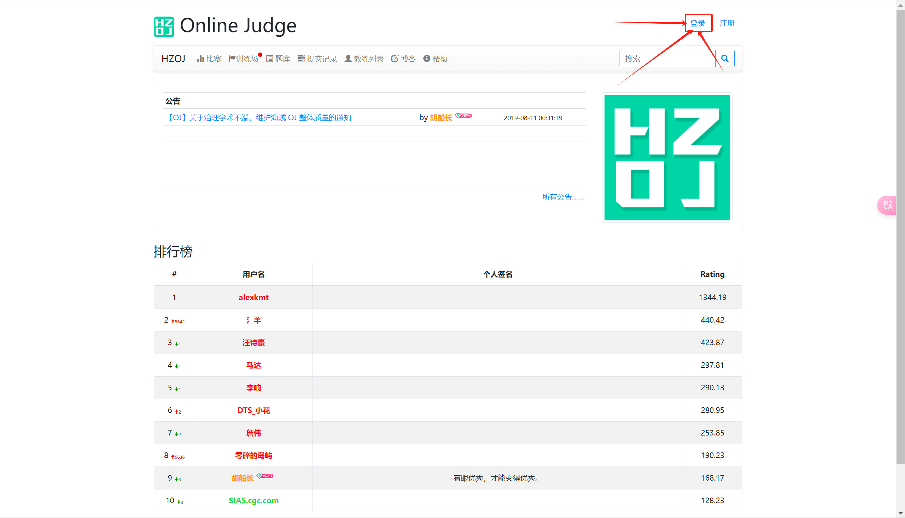
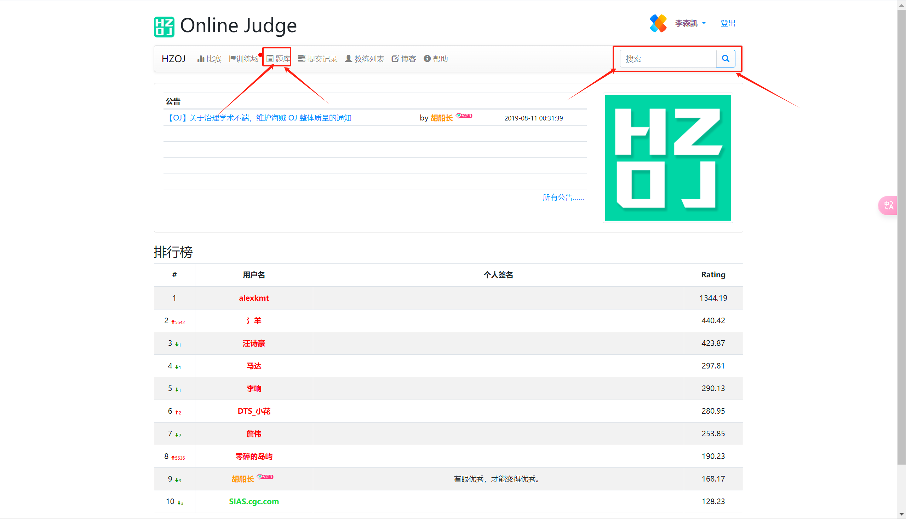
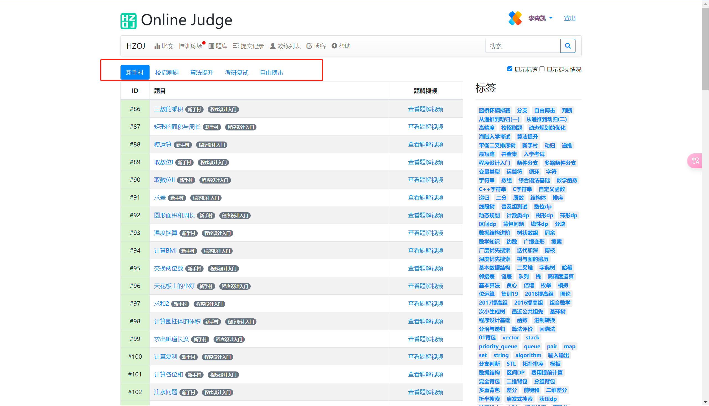
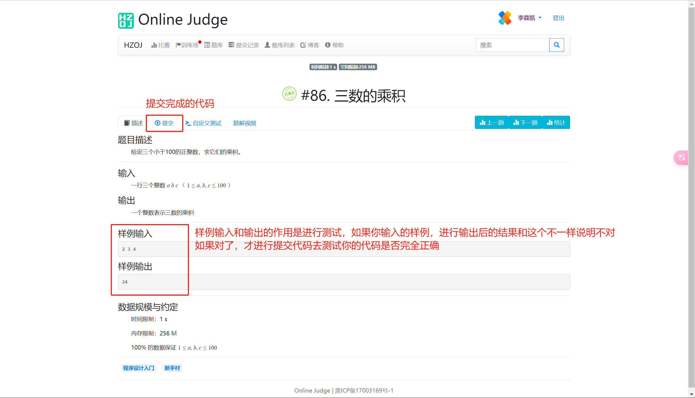
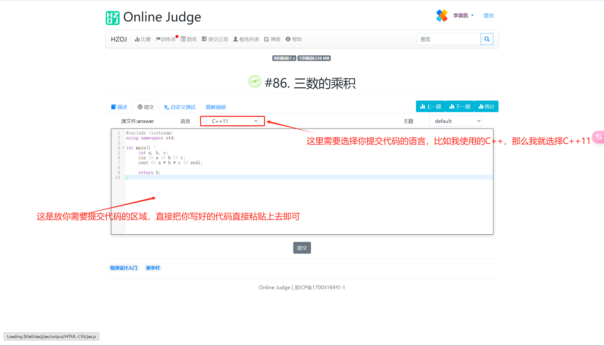
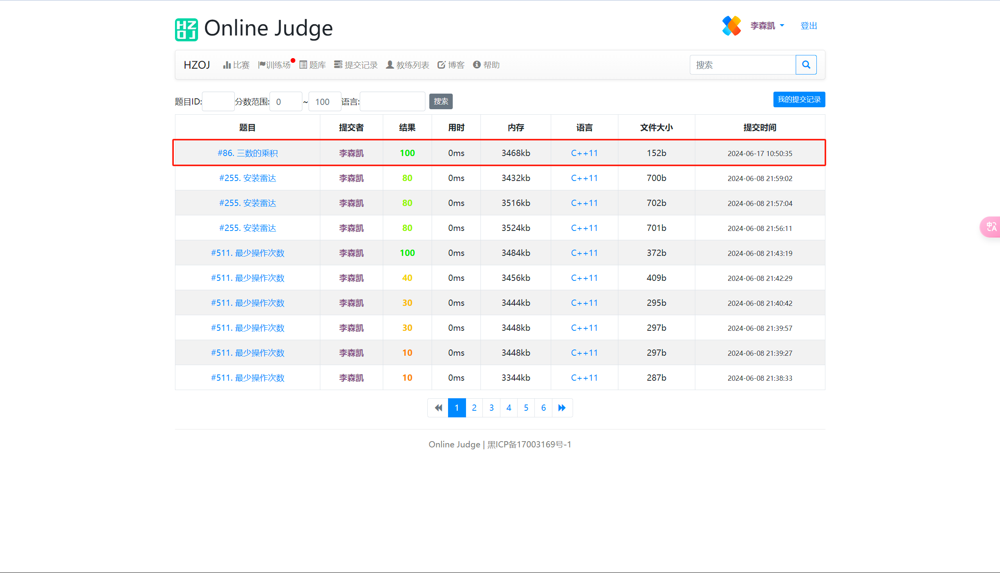
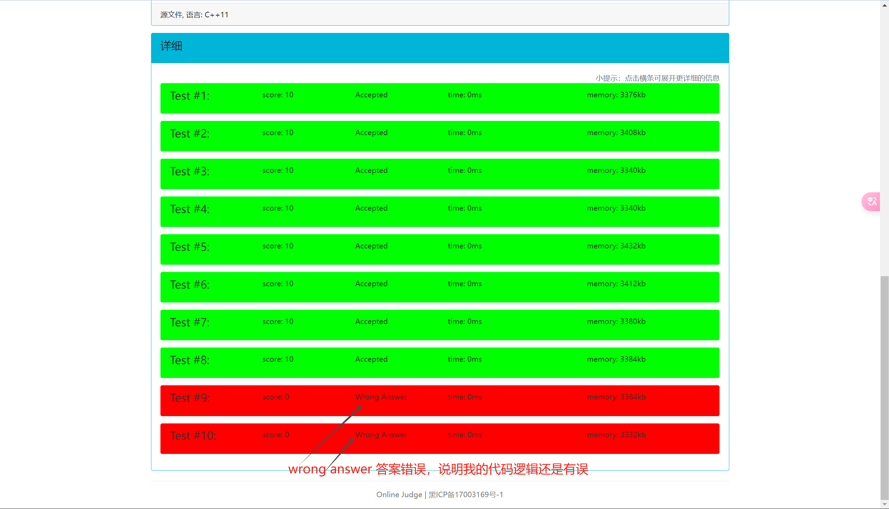

# 1.海贼宝藏注册与登录

第一步：打开海贼宝藏官网-[官网链接](https://www.haizeix.com/){target='_blank'}

第二步：注册账号，在海贼官网的右上角

第三步：注册完成以后，登录账号，也在海贼官网的右上角

# 2.宝藏大会员如何如何兑换课程

提醒：这里的教程是需要拥有宝藏大会员才能完成的

第一步：找到你想兑换的课程(并且课程带有会员免费)

例如：官网首页往下滑动，可以看到下图中一些带有会员免费的课程

第二步：兑换课程

例如：我点入上面图中的一门课叫做《编码能力训练课》，
然后可以看到会员免费兑换，进行点击就可以兑换成功这门课程。

第三步：如何查找正在学习的课程

然后就可以看到正在学习中的课程，就可以继续学习相应的课程

# 3.OJ刷题

第一步：进入OJ网站，在海贼官网的导航栏中可以找到《OJ刷题》

[OJ刷题](https://oj.haizeix.com/)

第二步：登录，可以直接使用海贼宝藏注册的手机号进行登录

第三步：如何找到题目

如图，可以进入题库，也可以进行搜索题目

进入题库后：

可以看到,红框圈出的相关字样，每个标签对应的难度：

新手村：适合刚刚学习和入门的小白，每个题目都附有题解视频;

校招刷题：适合有一定算法和数据结构基础的同学，如果面向的是工作可以进行AC这部分的题目，并且附有题解视频;

算法提升：适合对于算法提升的同学并且包含一些数学知识，这部分的题目面向的是竞赛的同学，并且附有题解视频;

考研复试：这部分的题目面向的考研的同学，比较简单，也有部分比较难的题目;

自由搏击：这部分的题目有比较困难的题，也有简单题，但是没有题解视频，适合算法基础比较好的同学;

第四步：AC一道题目

例如：先需要AC新手村的第一题，86-三数乘积

提交代码：

完成图中的操作后，点击提交。

可以看到图中,结果为100分，说明通过这道题目的测试

如果没有100分，可以进行点击分数查看为什么出现问题

例如图中第二条255题，我只有80分，直接点击分数可以进行查看：

第五步：查看题解视频

注意：题解视频

点击题解视频会自动跳转到对应的题解视频

